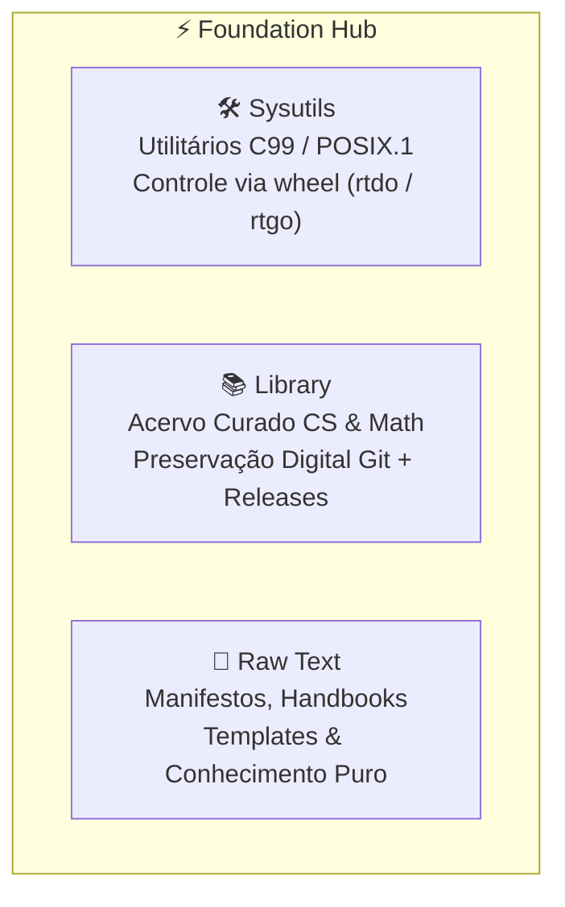

# ⚡ Foundation Hub

> **Orquestrador Federado de Utilitários de Sistema, Preservação Técnica & Texto Puro**<br />
> _O pilar fundacional do ecossistema de engenharia de Gabriel Frigo._

<div align="center">

[](LICENSE)
[](https://pubs.opengroup.org/onlinepubs/9699919799/)
[](https://github.com/GabrielFrigo4/foundation/actions/workflows/submodules.yml)
[](https://github.com/GabrielFrigo4)

</div>

---

## 📖 Visão Geral

O repositório **Foundation** é o ponto de entrada canônico para as ferramentas e referências essenciais do ecossistema. Inspirado na simplicidade atemporal do Unix, ele reúne três pilares complementares de software e conhecimento:



---

## 🧩 Os Componentes do Foundation

| Componente                    | Foco & Responsabilidade                                                        | Tecnologias Centrais    | Repositório Remoto                                                        |
| :---------------------------- | :----------------------------------------------------------------------------- | :---------------------- | :------------------------------------------------------------------------ |
| [**`Sysutils`**](Sysutils/)   | Suíte minimalista de ferramentas e elevação de privilégios (`rtdo`, `rtgo`)    | C99, POSIX.1-2008, Make | [`GabrielFrigo4/core-posix`](https://github.com/GabrielFrigo4/core-posix) |
| [**`Library`**](Library/)     | Acervo atemporal e preservação digital de bibliografia essencial em computação | Markdown, LaTeX, Git    | [`GabrielFrigo4/core-tech`](https://github.com/GabrielFrigo4/core-tech)   |
| [**`Raw Text`**](Raw%20Text/) | Base de conhecimento em texto puro, manifestos técnicos e templates            | Plain Text, POSIX Shell | [`GabrielFrigo4/raw-data`](https://github.com/GabrielFrigo4/raw-data)     |

---

## 🚀 Como Obter e Operar

```sh
# Clonagem completa com todos os submódulos
git clone --recursive "https://github.com/GabrielFrigo4/foundation.git"
cd foundation

# Ou clonagem simples seguida de inicialização
git clone "https://github.com/GabrielFrigo4/foundation.git"
cd foundation
make clone
```

### Operações com o Makefile

```sh
make status    # Inspeciona o estado Git de todos os submódulos
make pull      # Atualiza os submódulos com as branches principais
make test      # Executa verificações e quality gates locais
```

---

## 📜 Governança e Princípios

- **Princípios de Engenharia:** Consulte [PRINCIPLES.md](PRINCIPLES.md) para os 18 princípios canônicos aplicados.
- **AI Agent Briefing:** Instruções estritas de operação para agentes autônomos em [AGENTS.md](AGENTS.md).
